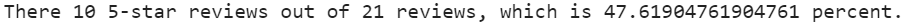

# Amazon_Vine_Analysis

## Overview of the analysis
### What is my dataset about and what is it I want to learn from it?

This analysis helps me to estimate biasedness/unbiasedness of reviews in Amazon Vine. Amazon Vine program invites reviewers writing most insightful reviews in the past and provide them with free products from selling partners to review them. Neither Amazon, nor partners can modify the reviews.

I use a dataset with reviews on luggage pieces.

## Results
### So whose reviews seem less biased?

program|results
---|---
Vine:|
not Vine|

So:
- There are 21 vine reviews and 6690 non-vine reviews.
- There are 10 5-star vine reviews and 3448 5-star non-vine reviews.
- Percentage of 5-star reviews among total vine reviews is 47.52%, and it's 51.54% for non-vine reviews.

## Summary
### Should we jump to conclusions?

Vine participants seem to be even sterner than the customers not participating in the program: percentage of 5-star reviews is lower among their reviews. But the data on vine reviews is tiny. For instance, if there had been 11 5-star reviews, the percentage would have increased up to 0.52380952381 percent, which is even more than non-Vine 5-star reviews percentage.

The above means we shouldn't hurry with any conclusions about reviews' biasedness.

### What should we do next?

I propose to compare percentages for 1-4-star reviews. The numbers may be higher there, which will make our conclusions more valid.

If it turns out there are much more 4-star reviews and much less 2-star reviews percentage for Vine reviewers than than for non-Vine ones, it could be some biasedness story there.

And one more thing: "professional" reviewers may find 1 and 5-star too dramatic for pros. It makes another good case for looking into 2 and 4-star reviews.
