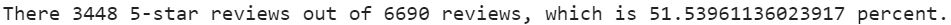

# Amazon_Vine_Analysis

## Overview of the analysis

This analysis helps me to estimate biasedness/unbiasedness of reviews in Amazon Vine. Amazon Vine program invites reviewers writing most insightful reviews in the past and provide them with free products from selling partners to review them. Neither Amazon, nor partners can modify the reviews.

I use a dataset with reviews on luggage pieces.

## Results

